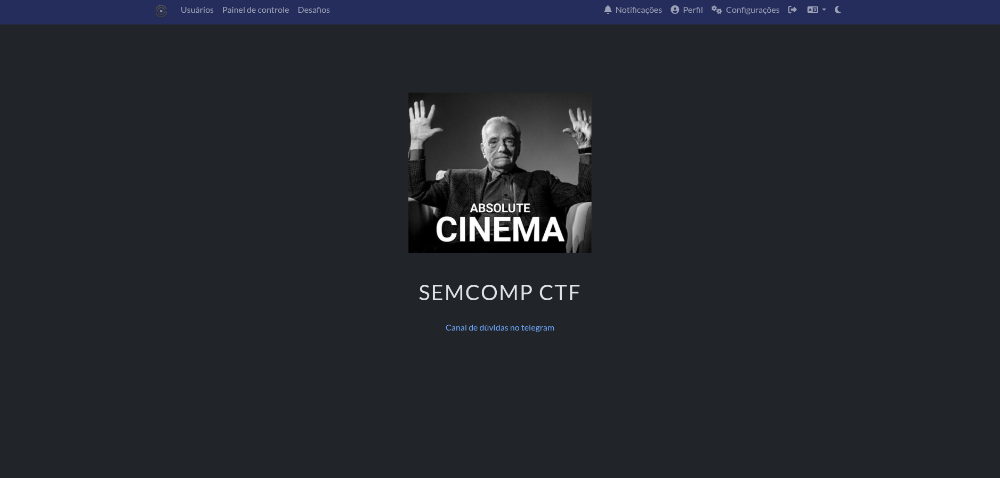

# SEMCOMP CTF 2025

### Sobre o evento

Este CTF foi realizado durante a **Semana da Computação** do Instituto de Ciências Matemáticas e de Computação (ICMC) da USP São Carlos, em 2025, em parceria com o grupo de extensão **Ganesh**. Os desafios ficaram disponíveis na plataforma [https://ganesh.icmc.usp.br/ctf/](https://ganesh.icmc.usp.br/ctf/) dos dias 20/10/25 às 14:00 até 23/10/25 às 23:59.  

### Os desafios

Os challs foram divididos, como comumente ocorre em CTFs padrões; categorias como **Cripto, Misc, OSINT, Pwn, Rev, Redes e Web** estavam inclusas na competição, com a adição da categoria **Multiplas_Frentes**, que descreve os desafios que englobam mais de um setor de conhecimento. O número de problemas está listado na tabela a seguir:

| Cripto | Misc | OSINT | Pwn | Rev | Redes | Web | Multiplas_Frentes | Total |
|:------:|:----:|:-----:|:---:|:---:|:-----:|:---:|:-----------------:|:-----:|
|    6   |  19  |   8   |  13 |  4  |   9   |  3  |         2         |  64   |

### Meus solves e Write-ups

Ao todo, resolvi 21 challs, com as categorias divididas na tabela:

| Cripto | Misc | OSINT | Pwn | Rev | Redes | Web | Multiplas_Frentes | Total |
|:------:|:----:|:-----:|:---:|:---:|:-----:|:---:|:-----------------:|:-----:|
|    3   |   1  |   2   |  6  |  3  |   4  |  2  |         0         |   21  |

Os desafios que mais me engajaram durante a SEMCOMP 2025 estarão com seus respectivos write-ups documentados.
